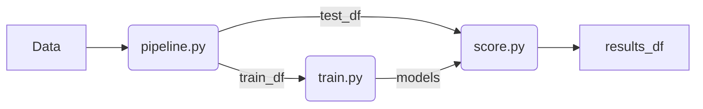

This is our solution to  
**Risk Management Case Competition**  
by *Freedom Insurance*

Please download data for the case to the `final_dataset` folder  
To read more about the case follow this [link](https://drive.google.com/drive/folders/link_to_case)

##### Data
2 percent end up in crashes. Company pays 668735.8 per claim  
On average company pays 13026.95 to the insured  
On average company receives 10554.13 from premiums (taking into acount cancelations)  
Thus company is losing money at the current period  
The ratio of payments to premuims is 123 percent. This puts company at the loss.

##### Schema of Deployment

