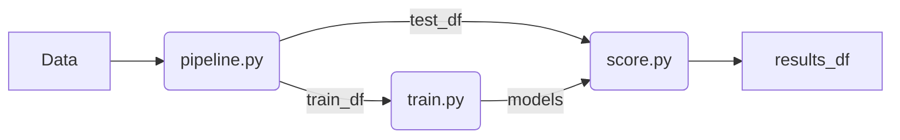

This is our solution to  
**Risk Management Case Competition**  
by *Freedom Insurance*

Please download data for the case to the `final_dataset` folder  
To read more about the case follow this [link](https://drive.google.com/drive/folders/link_to_case)

##### Schema of Deployment

