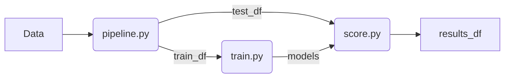

This is our solution to  
**Risk Management Case Competition**  
by *Freedom Insurance*

Please download data for the case to the `final_dataset` folder  
To read more about the case follow this [link](https://drive.google.com/drive/folders/link_to_case)

#### Data
2 percent end up in crashes. Company pays 668735.8 per claim  
On average company pays 13026.95 to the insured  
On average company receives 10554.13 from premiums (taking into acount cancelations)  
Thus company is losing money at the current period  
The ratio of payments to premuims is 123 percent. This puts company at the loss.

#### Schema of Deployment

```mermaid
graph LR
Data --> B(pipeline.py)
B --> |train_df| C(train.py)
B --> |test_df| D(score.py)
C --> |models| D
D --> results_df
```

#### Model
Our general model follows a simple logic.  
For any given insuree, their premium payments should be more than their expected loss. That is,

$$
E[P_i] \geq E[L_i]
$$

where,
$P_i$ is the premium paid by client $i \in {1, 2, ..., N}$  
$L_i$ is the loss occured from client $i$. Note that $L_i = 0$ if client $i$ doesn't end up in car accident.  

Here we take both metrics into expected value as both have elements of stochasticity. Obviously, we incur loss only if there is going to be an accident. However we should also take into account the fact that people may cancel their insurance and premiums is not guaranteed to come fully. As such, our model can be further decomposed as:

$$
\begin{aligned}
E[P_i] &= P_i \cdot Pr(C_i = 1) \qquad \text{and, } \\
E[L_i] &= Pr(D_i = 1)  \cdot  E[L_i | D_i = 1) 
\end{aligned}
$$

where,  
$D_i$ is the indicator variable that tells us whether a given client participates in a car crash.  
$C_i$ is the indicator variable that tells us whether a given client have cancelled their premium  
$X_i$ is the matrix of the client characteristics.  

We assume that $P_i$ is only variable under our control and we will use the following predictive models to callulate remaining elements of our model.
* $f^c(X_i)$ calculates the probability of insurance cancellation for individual $i$
* $f^{pc}(X_i)$ calculates the probability of individual $i$ ending up in accident
* $f^{lgc}(Y_i)$ calculates the expected payment given crash. Here, $Y_i$ is the matrix of characteristics of the car.

We give two reasons why characteristics of the car is the main components of the loss given crash element.
1. Repair cost after crash will differ from car to car
2. Cars varies in their safety capabilities. This impact the possibility of the injury payments. Safer cars will cost less in injure and death related payments.
